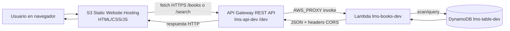

# Explicación de la App Serverless (LMS)

Este documento explica, en español y de forma práctica, cómo funciona esta aplicación serverless de biblioteca usando AWS.

## 1) Componentes principales

- `Frontend estático` en **Amazon S3 Static Website Hosting**
- `API REST` en **Amazon API Gateway**
- `Lógica de negocio` en **AWS Lambda**
- `Base de datos NoSQL` en **Amazon DynamoDB**

Recursos que usa este proyecto (según scripts):
- Bucket S3: `lms-static-<ACCOUNT_ID>-us-east-1`
- Lambda: `lms-books-dev`
- API Gateway: `lms-api-dev` (stage `dev`)
- DynamoDB: `lms-table-dev`

## 2) Diagrama sencillo



Versión ASCII:

```text
Navegador
  -> S3 (sitio estático: index.html + app.js)
  -> API Gateway (/dev/books, /dev/search)
  -> Lambda (lms-books-dev)
  -> DynamoDB (lms-table-dev)
  -> Lambda arma JSON
  -> API Gateway responde
  -> Frontend renderiza libros/resultados
```

## 3) ¿Cómo se sirve lo estático?

1. El script `scripts/deploy-step3-s3.sh` crea el bucket S3 y activa `website hosting`.
2. El script `scripts/deploy-step6-frontend.sh` sube los archivos de `frontend/src/` al bucket.
3. El navegador abre una URL tipo:
   `http://lms-static-<ACCOUNT_ID>-us-east-1.s3-website-us-east-1.amazonaws.com`
4. Ahí se carga `index.html` y luego `app.js`.

En `frontend/src/app.js` hay una constante:

```js
const API_BASE_URL = 'https://<api-id>.execute-api.us-east-1.amazonaws.com/dev';
```

Esa URL conecta el frontend con API Gateway.

## 4) Flujo completo de una petición (ejemplo real)

### Caso A: Listar libros (`GET /books`)

1. El usuario entra al sitio S3.
2. `app.js` ejecuta `fetch(`${API_BASE_URL}/books`)`.
3. API Gateway recibe `GET /dev/books`.
4. API Gateway invoca Lambda (`AWS_PROXY`).
5. Lambda (`books_handler_cors.py`) detecta ruta `/books` y hace `scan` en DynamoDB filtrando `entity_type = 'book'`.
6. Lambda arma un JSON `{ "books": [...] }` y devuelve `statusCode: 200`.
7. API Gateway retorna esa respuesta al navegador.
8. El frontend dibuja las tarjetas de libros en pantalla.

### Caso B: Buscar (`GET /search?q=...`)

1. El usuario escribe en el input de búsqueda.
2. `app.js` llama `/search?q=texto&limit=10`.
3. API Gateway invoca Lambda.
4. Lambda consulta DynamoDB usando el índice `GSI1` con `begins_with(...)` para autocompletado.
5. Lambda devuelve lista filtrada.
6. Frontend muestra sugerencias de búsqueda.

## 5) CORS: por qué funciona entre dominios

Como el frontend está en dominio S3 y la API en `execute-api.amazonaws.com`, hay **cross-origin**.

Este proyecto lo resuelve de dos formas:

- En API Gateway se crea método `OPTIONS` (MOCK) para preflight.
- En Lambda se devuelven headers CORS (`Access-Control-Allow-Origin`, etc.) en cada respuesta.

Sin esto, el navegador bloquearía la llamada.

## 6) Qué aprende un estudiante DevOps aquí

- Separar `frontend estático` y `backend serverless`.
- Exponer API pública de forma controlada con API Gateway.
- Conectar funciones Lambda con DynamoDB sin servidores administrados.
- Automatizar despliegue por pasos con scripts (`deploy-step1` ... `deploy-step6`).
- Entender el patrón event-driven: HTTP event -> Lambda -> DB -> HTTP response.

## 7) Resumen en una frase

El navegador carga una web estática desde S3; esa web llama a API Gateway; API Gateway invoca Lambda; Lambda consulta DynamoDB y devuelve JSON; el frontend renderiza el resultado al usuario.
